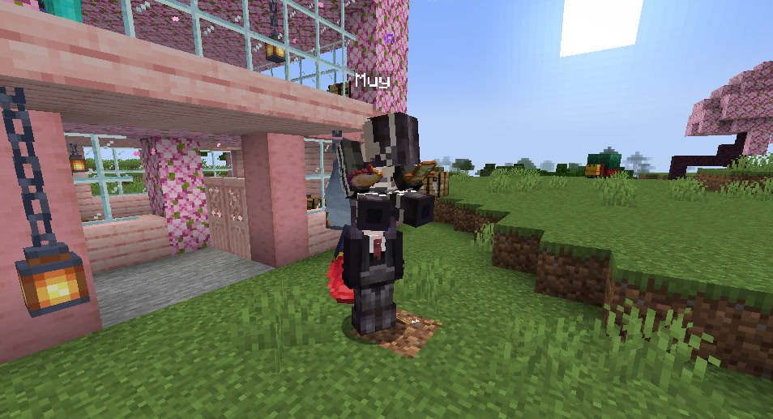
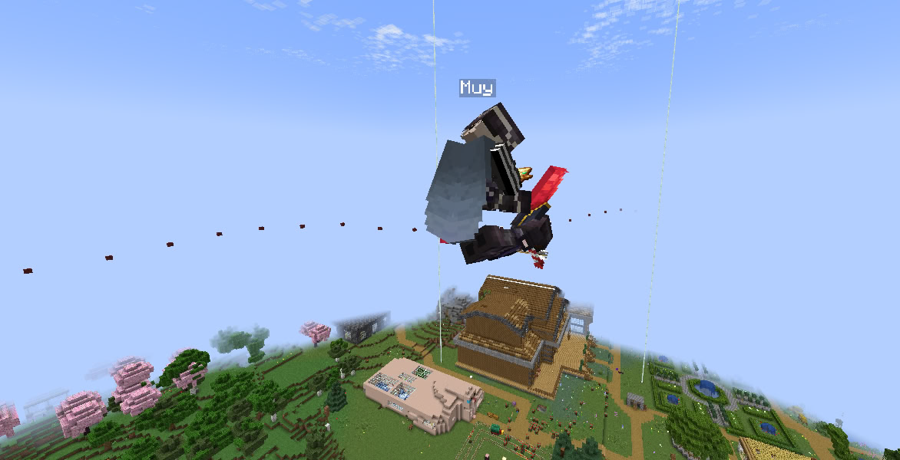

# PickMeUp 
### Carry your Entities around gently or throw them away 

# How to use

Sneak and click with empty hand on entity you want to pick





# Config

```yml
# This is the debug level of the plugin. Dont change this unless requested.

mobSettings:
  ==: pickMeUpMobSettings
  # List of allowed mobs (default: PIG, CHICKEN, RABBIT, WOLF, BOAT, SHEEP, PARROT)
  # https://hub.spigotmc.org/javadocs/spigot/org/bukkit/entity/EntityType.html
  allowedMobs:
  - PIG
  - PARROT
  - FOX
  
  # List of blacklisted mobs that cannot be picked up
  blackListedMobs:
  - ENDER_DRAGON
  - WITHER

  
  # Allow picking up all hostile mobs (overrides allowedMobs)
  allowAllHostileMobs: false
  
  # Allow picking up players
  allowPlayers: true

    # Allow picking up all peaceful mobs (overrides allowedMobs)
  allowAllPeacefulMobs: true
  
  # Require permission to pickup mobs
  requirePermission: true
  


carrySettings:
  ==: pickMeUpCarrySettings
  # The force with which a entity will be thrown when the bar is full
  throwForce: 2.0
  # Allow to pickup entites which have also a entity as passenger
  allowStacking: false


 debug: INFO

```